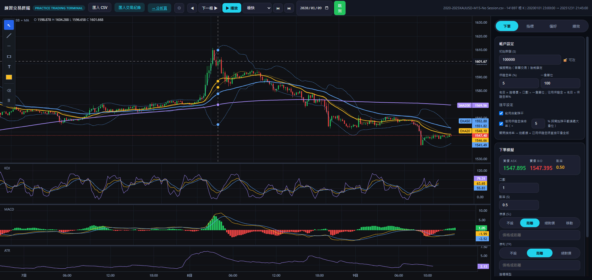
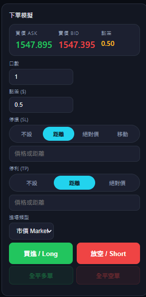
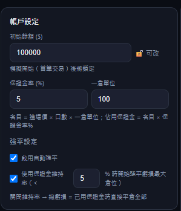
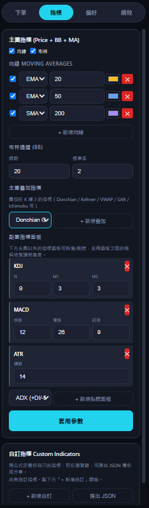
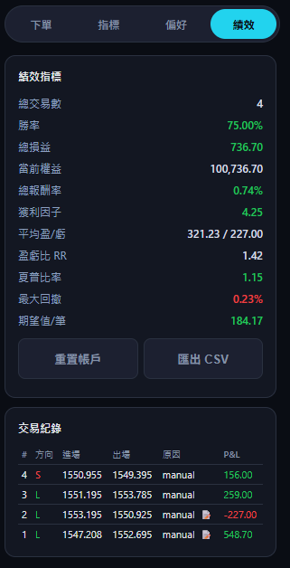
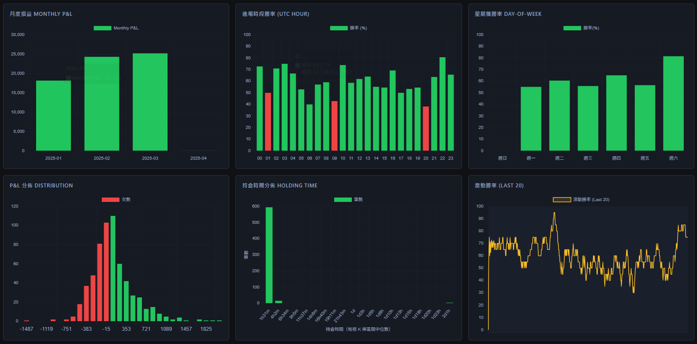
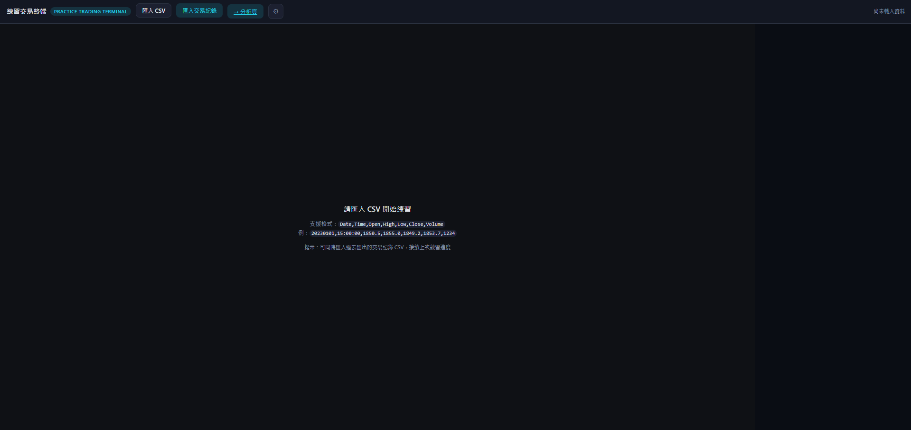

<div align="center">

# 練習交易終端 Practice Trading Terminal

**瀏覽器端零依賴、可用方塊拖曳自訂指標、支援多倉位保證金引擎的模擬交易練習平台**



[線上試用](https://YOUR_USERNAME.github.io/trading-practice) · [截圖展示](#截圖展示) · [技術亮點](#技術亮點)

</div>

---

## 為什麼做這個

現有的紙上交易工具，你只能在「精緻」與「掌控度」之間二選一：TradingView 一個月 $30，MT4 外掛介面老舊。我想要一個：

- **完全在瀏覽器端運作** — 不用帳號、不用伺服器、資料不會離開你的裝置
- **讓非工程師也能視覺化打造技術指標**（方塊拖曳編輯器，不是 Pine Script）
- **模擬真實券商機制** — 買賣價差、保證金、強制平倉、每倉獨立停損停利
- **教導良好習慣** — 過度交易、連敗冷靜、未設停損、槓桿過高等行為警示

這是我的作品集，用約 6000 行純 vanilla JavaScript 展示架構設計、演算法思維與產品思考。

---

## 截圖展示

### 主畫面
K 線圖表、指標、繪圖工具與交易側邊欄整合在單一視圖中。


### 自訂指標編輯器 — 雙模式共用同一 AST
非工程師可以拖拉「型別化方塊」組合出技術指標，公式編譯器將其轉為經快取的 JS 閉包。方塊模式與文字模式**共用同一份儲存格式**，切來切去無縫接軌。

<div align="center">

| 方塊模式 | 文字模式 |
| :---: | :---: |
| .png) | .png) |

</div>

### 側邊欄各功能特寫

<div align="center">

| 下單 & 倉位 | 帳戶 & 保證金 | 指標管理 | 績效面板 |
| :---: | :---: | :---: | :---: |
|  |  |  |  |

</div>

### 分析頁儀表板
11 個視覺化維度，從權益曲線到出場原因分析，全部從 `localStorage` 中的交易紀錄即時計算。

**總覽、權益曲線、回撤**

.png)

**月度損益、進場時段勝率、星期幾勝率、P&L 分佈、持倉時間分佈、滾動勝率**



**Long/Short 對比、出場原因分析、完整交易明細**

.png)

### 第一次開啟
還沒匯入 CSV 前的畫面 — 專案內附 `sample_data/` 資料夾內的樣本可直接使用。

<div align="center">

</div>

---

## 功能亮點

**圖表與指標** — 內建 12 種技術指標（BB、MA、KDJ、MACD、ATR、RSI、Stoch、Volume、ADX、Momentum、ROC、CCI、Williams %R）；6 種主圖疊加（Donchian、Keltner、VWAP、SAR、SuperTrend、Ichimoku）；無數量限制的自訂均線；副圖可新增、刪除、拖曳調整高度。

**自訂指標** — 兩種創作模式：文字公式（`(close - sma(close, period)) / (2 * sd * std(close, period))`）或視覺方塊編輯器（支援方塊互換）。兩者編譯到相同 AST，儲存於 `localStorage`，可匯出成 JSON 分享。

**訂單類型** — 市價、限價、停損觸發（Stop）、OCO 對沖組合。每張掛單都可以帶自己的 SL/TP 設定，在成交當下自動套用。

**SL/TP 模式** — 不設 / 距離（美元） / 絕對價 / 移動止損（可搭配止損底線作為最後安全網）。移動止損採用保守的「先檢查、後更新」bar-resolution 順序，避免同根 K 棒的上下影線造成假訊號觸發。

**多倉位保證金引擎** — 可同時開任意數量多空倉位（僅受保證金限制）。可調整保證金比率、一倉單位（例如黃金 CFD 100 盎司、白銀 5000 盎司）。內建強制平倉機制：可設維持率門檻（優先平掉虧損最大的倉位）或全平模式（當總虧損 = 已用保證金時全平）。

**行為警示** — 可獨立開關的五種警示：未設停損、過度交易（每小時 > N 筆）、連敗冷靜（連 N 筆虧損）、單筆風險過大（> 帳戶 X%）、名目槓桿過高。

**交易筆記** — 可選的開倉前提示（「為什麼下這單？」）、平倉時提示（「這筆學到什麼？」），CSV 匯出時保留筆記欄位。

**繪圖工具** — 趨勢線、水平線、矩形、文字標籤；可拖曳移動、`Ctrl+C`/`Ctrl+V` 複製貼上、`Delete` 刪除。

**分析頁儀表板** — 11 個視覺化：權益曲線、回撤、月度損益、時段勝率、星期幾勝率、P&L 分佈、持倉時間分佈、滾動勝率、Long/Short 對比、出場原因分析、完整交易明細。

**多國語言** — 中文 / English 即時切換，透過 `localStorage` + `storage` events 讓分析頁自動同步。

---

## 技術亮點

面試時我會拿來聊的技術細節：

**自訂指標公式編譯器** — 手寫的遞迴下降語法分析器將 `sma(close, period) - ema(close, 50)` 這類表達式 tokenize → AST → 產生呼叫向量化 helpers 的 JS source。編譯後的表達式用 `new Function()` 快取，5000 根 K 棒視窗執行 <5ms。支援 element-wise 的 + / − / × / ÷ 運算子，自動處理陣列與純量的型別強制轉換與 null 傳播。

**方塊視覺編輯器** — AST↔block-tree 雙向轉換，使文字模式與方塊模式共用同一份儲存格式。支援方塊間拖曳互換，並含祖先/子孫循環偵測。HTML5 drag-and-drop + 浮動 slot picker。整個編輯器約 350 行程式碼。

**多倉位保證金引擎** — `STATE.positions[]` 陣列模型，每倉獨立記錄名目金額、進場當下鎖定的保證金、當前浮動 P&L。強制平倉迴圈從虧損最大的倉位開始平，直到維持率恢復。所有倉位邏輯（SL/TP 檢查、移動止損、批次平倉、圖表 marker、SL/TP 水平線）都是陣列迭代版本。

**移動止損的 Bar-resolution 取捨** — 移動止損有一個本質上的模糊性：單根 K 棒內我們無法知道最高點與最低點誰先誰後。採用「保守順序」（`checkSLTP → checkPendingOrders → updateTrail`），trail 拉高的效果從**下一根** K 棒才套用。程式碼註解中有詳細的工程說明。

**渲染視窗化效能優化** — 當游標在 100K+ 根位置時，直接渲染全歷史需要 500ms–2s。將每次刷新的計算量限制在滾動視窗 `RENDER_WINDOW = 5000` 根之內。結果：10–40 倍速度提升，視覺脈絡幾乎無損（5000 根 M15 ≈ 52 個交易日）。

**分析頁零後端** — 全部 11 個儀表板都從 `localStorage` 序列化的交易紀錄計算。跨頁語言同步透過 `storage` events 完成，不需要共享狀態或 IPC。

**繪圖工具的 SVG 疊加層** — 繪圖以 `{time, price}` 世界座標儲存，每次視窗範圍變動就重新投影成像素座標。水平線僅可垂直拖曳、趨勢線/矩形/文字可全方向拖曳。約 400 行實作。

---

## 技術棧

- **零 build step** — 純 HTML/CSS/JS，任何靜態伺服器都能跑
- **[Lightweight Charts](https://www.tradingview.com/lightweight-charts/)** — 與 TradingView 同一套繪圖引擎（開源）
- **[Chart.js](https://www.chartjs.org/)** — 分析頁儀表板
- **[PapaParse](https://www.papaparse.com/)** — CSV 解析
- **`docx`**（僅在建置開發紀錄時用到，位於 `dev-log/`）
- **零框架依賴** — 沒有 React、沒有 Vue，約 6000 行 vanilla JS

---

## 快速開始

**方式 1 — 線上試用（推薦）**
直接打開 [YOUR_USERNAME.github.io/trading-practice](https://YOUR_USERNAME.github.io/trading-practice)，匯入任意 OHLC 格式 CSV 就能開始練習。

**方式 2 — 本地執行**
```bash
git clone https://github.com/YOUR_USERNAME/trading-practice.git
cd trading-practice
# 任意靜態伺服器皆可，以 Python 為例：
python -m http.server 8000
# 開啟 http://localhost:8000
```

**方式 3 — 直接雙擊開啟**
所有檔案都是靜態的，直接雙擊 `index.html` 就可以（但用伺服器跑會讓 `localStorage` 保留更穩定）。

**CSV 格式**
```csv
Date,Time,Open,High,Low,Close,Volume
20200101,15:00:00,1550.5,1552.0,1549.2,1551.7,1234
```

`sample_data/` 資料夾內有樣本可直接使用。

---

## 專案結構

```
trading-practice/
├── index.html              # 練習終端主頁
├── analytics.html          # 分析頁儀表板
├── assets/
│   ├── styles.css          # v2 設計系統 tokens + 全部樣式
│   ├── app.js              # ~6000 行：圖表、指標、交易引擎
│   ├── analytics.css
│   └── analytics.js        # ~500 行：分析頁渲染
├── sample_data/            # 內建 OHLC 樣本
├── dev-log/                # 開發紀錄（自動產生的 .docx）
├── docs/
│   ├── DEPLOY.md           # GitHub Pages 部署指引
│   └── screenshots/        # README 用圖片
└── .github/workflows/
    └── deploy.yml          # 自動部署到 GitHub Pages
```

---

## 開發路線圖

後續正在思考的功能：

- **互動式教學導覽** — 5 分鐘首次使用引導
- **情境範例庫** — 預載有趣的歷史片段並附提示（「試試這個突破設定」、「這裡練均值回歸」）
- **多時間框架同步** — 在較高時間框架加一個小副圖
- **策略回測執行器** — 讓使用者定義規則自動執行
- **多商品比較** — 同時載入黃金 + 白銀 + 原油，觀察跨市場相關性

---

## 貢獻

歡迎 Issues 與 PRs。如果你有想分享的策略或指標範本，我很樂意加入專案。

---

## 授權

[MIT](LICENSE) — 個人與商業用途皆免費。

---

<div align="center">
花了大約 2 週用 ☕ 打造。歡迎意見與批評 — <a href="https://github.com/YOUR_USERNAME/trading-practice/issues/new">開個 issue</a>
</div>
